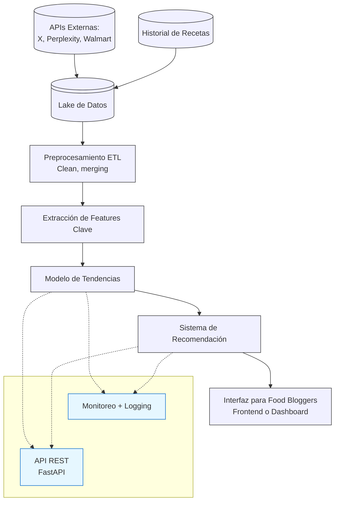

# Sistema de Recomendación Proactivo para Food Bloggers - freshFork

**Candidato**: Alejandro Moscoso Deossa

**Tiempo real utilizado**: 2h

**Fecha**: 01/07/2025

---

## 1. Arquitectura End-to-End

## 2. Stack Propuesto y Justificación

| Componente | Tecnología | Justificación |   Alternativa |
|------------|------------|---------------|---------------|
| Orquestación | Azure Data Factory | Orquestación visual, scheduling de pipelines y transformaciones básicas | Apache Kafka |
| Almacenamiento |  Data Lake Gen2 (Blob Storage) + SQL DB	Data Lake | Centralizado y escalable | PostgreSQL, S3, Azure SQL |
| Procesamiento | Azure Databricks (PySpark, Pandas) | Limpieza, unión y feature engineering | SQL |
| Modelado | Script en Azure Databricks + modelo registrado en Azure ML | Experimentos reproducibles | Prophet, MLflow, LightGBM, Word2Vec |
| Feature Store | Delta Lake | Versionado de features accesible desde Databricks | Opcional |
| API REST | FastAPI, Azure Function | Bajo costo y escalable | Azure App Service |
| Monitorización | Azure ML Studio | Métricas, alertas y trazabilidad | Prometheus + Grafana |
| Resultados | Azure Blob Storage, Azure SQL | Consulta, dashboarding y analítica posterior | Synapse |
| Frontend / BI | Power BI | Consulta, dashboarding y analítica posterior | Web App JS, CSS, React |

### Modelado y uso de IA
#### Para Detección de Tendencias
- LLMs + Agentes: Usar LangChain + GPT-4/Claude para analizar hashtags y comentarios en redes sociales.
- NER personalizado (HuggingFace Transformers) para extraer ingredientes emergentes de tweets.
- Prophet (Facebook): Para predecir crecimiento de ingredientes (simple y explicable).
- TensorFlow Si hay datos históricos robustos. (Redes neuronales. LSTM)
#### Para Sistema de Recomendación
- Word2Vec (similitud de ingredientes), BERT (HuggingFace).
- XGBoost, RandomForest, Neuronal Networks para rankear recetas basado en features (engagement histórico + tendencias).
- IA Generativa: LangChain + OpenAI: Generar recetas originales combinando ingredientes trending.
#### Técnicas Adicionales
- **RAG (Retrieval-Augmented Generation):** Recuperar recetas similares de una base de datos antes de generar nuevas.
- Agentes de Validación

## 3. Supuestos, Trade-offs y Riesgos
### **Supuestos**
- Las señales sociales y de compra están sincronizadas en el tiempo.
- Los ingredientes pueden mapearse semánticamente a través de embeddings.
- Existen suficientes recetas históricas para evaluar la performance.
- Acceso constante a APIs públicas y performance de recetas históricas.
- Los datos de redes sociales correlacionan con demanda real en supermercados.

### **Trade-offs**
- Modelos ligeros → + velocidad / - complejidad
- Código y modelado sin "cajas negras" para facilitar explicabilidad y mejoramiento en escala.
- Ingesta de APIs públicas requiere manejo de calidad y tasa de refresco
- Modelos ligeros vs deep learning: favorecemos explainability y rapidez de inferencia.
- Datos de redes sociales requieren normalización y smoothing.

### **Riesgos**
- Algunos ingredientes pueden viralizarse por razones no saludables
- **Cold-start**: Usar datos de estacionalidad histórica como baseline, clustering y embeddings preentrados u obtenidos de fuentes como huggingface
- **Volatilidad de tendencias**: riesgo de sobreajuste a señales temporales
- Sesgos geográficos (datos son diferentes entre regiones) 
- Privacidad y ética: evitar personalización invasiva o recomendaciones personalizadas sin consentimiento.
- Sesgos sociales (modas virales no saludables).
- Señales sociales recientes no precisamente indica comportamiento de compra inmediato.
- Datos no se actualizan en tiempo real por costos.
- Escalabilidad: Pipeline batch diario (MVP) vs Procesamiento en tiempo real.

### **Pensamiento crítico**
- **Ética y Salud** Filtro nutricional: Excluir ingredientes con alertas sanitarias (ej: altos en sodio).
- **Diversidad:** Balancear tendencias globales (ej: quinoa) con ingredientes locales accesibles.
- **Diversidad** Filtros de vegetarianismo, veganismo.
- **Transparencia:** Mostrar a los bloggers el "por qué" de cada recomendación (ej: "La quinoa tiene un 120% más de menciones esta semana").

## 4. Métricas y Experimentación
### **Offline**
| KPI | Definición | Target | 
|-----|-----------|--------|
| **Precision@7** | % de ingredientes recomendados que son tendencia a 7 días | ≥ 65% |
| **Novelty** | % de ingredientes nuevos vs. historial del blogger | 30-50% |
| **Trend Lag** | Horas entre tendencia real y detección | < 24h |
| **Coverage** | % de bloggers con ≥1 recomendación relevante/semana | ≥ 80% |
| **Serendipity** | Variedad de elementos y elementos inesperados pero relevantes | |
| **Diversidad Culinaria** | N° de categorías únicas de recetas sugeridas (ej: vegano, keto, baja caloría) | |

### **Online (A/B Testing)**
| KPI | Definición |
|-----|--------------------------|--------|
| **CTR** | Clics/Recomendaciones mostradas |
| **Adopción** | % de recetas guardadas por receta recomendada |
| **Retención** | Usuarios que vuelven en 7 días |
| **Tiempo en App** | Minutos/sesión |
| **Feedback explícito** | likes, comentarios, compartidos |

### **Calidad del Modelo**
| KPI | Definición | Frecuencia |
|-----|--------|------------|
| **Data Drift** | Variación entre en distribución de entrenamiento vs datos actuales | Diaria o semanal |
| **Throughput** | < 50 recs/segundo | En tiempo real |
| **Fallos** | % requests fallidos | 5% |
| **Reentrenamiento** | Cada 2 semanas | Automático |

### **Impacto Negocio**
| KPI | Métrica | 
|-----|---------|
| **Monetización** | Sponsorships atribuibles a tendencias IA |
| **Costo/Rec** | tiempo y recursos invertidos por recomendació < $0.001 por recomendación |
| **Retención** | Retención % de bloggers que usan el sistema 2+ veces/semana |
| **Satisfacción** | Encuesta NPS a bloggers (≥ 7/10) |
| **Adopción** | % de food bloggers que usan recomendaciones generadas |
| **Salud** | score promedio de salud o balance nutricional de recetas recomendadas |

